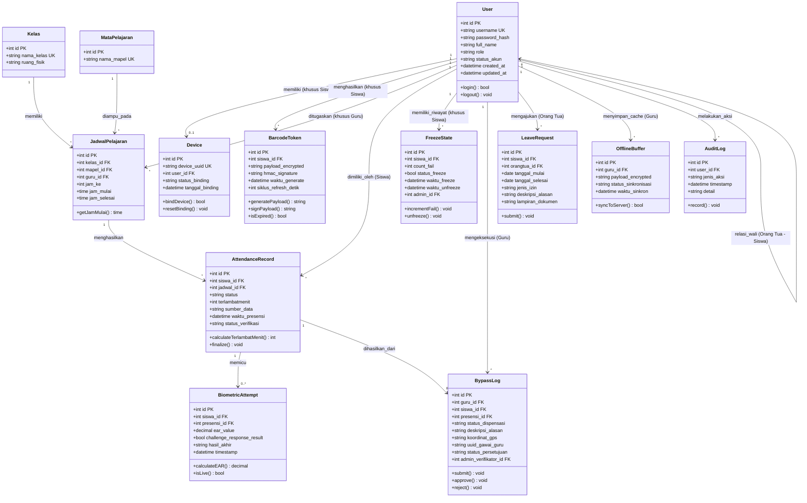

# Data Model

Document Version: v2.0

Project: Sistem Presensi Kehadiran Siswa Berbasis Kelas (Zero-Trust Attendance Protocol)

Product: Multi-Role Mobile Application (Sistem 1) & Centralized Web Application Portal (Sistem 2)

Status: Draft

Last Updated: 2026-07-12

Author: System Analyst AI

Source: Derived from SRS V2, IA V2.1, Design System V5, Integrated User Flow Blueprint V7.0, Technical Spec Face Biometrics & Liveness Detection V2.0 (SoT)

---

## 1. Overview

Dokumen ini mendefinisikan model data untuk Sistem Presensi Kehadiran Siswa Berbasis Kelas. Model diturunkan dari entitas bisnis inti yang tercantum pada SRS V2, IA V2.1, dan `system_logics/`. Tipe data teknis di bawah ini didefinisikan pada level konseptual (belum dispesifikasikan secara eksplisit oleh dokumen sumber sebagai skema database final), namun disesuaikan agar konsisten dengan kebutuhan fungsional tiap entitas.

---

## 2. Class Diagram

---

## 3. Entity Descriptions

### 3.1 User

Representasi akun pengguna lintas 5 role: Admin IT, Guru Mapel, Siswa, Orang Tua, Kepala Sekolah.

| Attribute | Type | Constraint | Description |
| --- | --- | --- | --- |
| id | INT | PRIMARY KEY, AUTO_INCREMENT | Identifier unik pengguna |
| username | VARCHAR(50) | UNIQUE, NOT NULL | Kredensial login |
| password_hash | VARCHAR(255) | NOT NULL | Password terenkripsi (bcrypt/argon2) |
| full_name | VARCHAR(100) | NOT NULL | Nama lengkap pengguna |
| role | VARCHAR(20) | NOT NULL | admin_it / guru_mapel / siswa / orang_tua / kepala_sekolah |
| status_akun | VARCHAR(20) | NOT NULL, DEFAULT 'aktif' | Aktif / Freeze (khusus role Siswa) |
| created_at | TIMESTAMP | NOT NULL, DEFAULT NOW() | Timestamp pembuatan akun |
| updated_at | TIMESTAMP | NOT NULL, DEFAULT NOW() | Timestamp update terakhir |

### 3.2 Device (Hardware Binding)

Mengikat identitas gawai fisik ke akun Siswa (SRS-FR-ADM-002).

| Attribute | Type | Constraint | Description |
| --- | --- | --- | --- |
| id | INT | PRIMARY KEY, AUTO_INCREMENT | Identifier unik |
| device_uuid | VARCHAR(100) | UNIQUE, NOT NULL | UUID/IMEI gawai |
| user_id | INT | FOREIGN KEY → User.id, NOT NULL | Relasi ke Siswa pemilik gawai |
| status_binding | VARCHAR(20) | NOT NULL, DEFAULT 'terikat' | Terikat / Reset Pending |
| tanggal_binding | TIMESTAMP | NOT NULL | Tanggal otorisasi binding perdana oleh Admin IT |

### 3.3 Kurikulum & Kelas (Kelas, MataPelajaran, JadwalPelajaran)

Master data akademik dikelola Admin IT (SRS-FR-ADM-001).

| Entitas | Atribut Kunci | Description |
| --- | --- | --- |
| Kelas | id (PK), nama_kelas (UK), ruang_fisik | Daftar ruang kelas fisik |
| MataPelajaran | id (PK), nama_mapel (UK) | Master mata pelajaran |
| JadwalPelajaran | id (PK), kelas_id (FK), mapel_id (FK), guru_id (FK), jam_ke, jam_mulai, jam_selesai | Alokasi Jam ke-1 s.d Jam ke-X, dasar kalkulasi `terlambatmenit` |

### 3.4 BarcodeToken

Token dinamis presensi siswa (SRS-FR-SWS-001).

| Attribute | Type | Constraint | Description |
| --- | --- | --- | --- |
| id | INT | PRIMARY KEY, AUTO_INCREMENT | Identifier token |
| siswa_id | INT | FOREIGN KEY → User.id, NOT NULL | Relasi ke Siswa |
| payload_encrypted | TEXT | NOT NULL | AES_256_CBC(Timestamp_Epoch \|\| DeviceID_Siswa \|\| GeoHash_Location) |
| hmac_signature | VARCHAR(255) | NOT NULL | HMAC_SHA256(payload, K_Private_Secret) |
| waktu_generate | TIMESTAMP | NOT NULL, DEFAULT NOW() | Timestamp pembuatan token |
| siklus_refresh_detik | INT | NOT NULL, DEFAULT 30 | Siklus refresh (30 detik) |

### 3.5 AttendanceRecord (Presensi)

Entitas inti — satu baris per Jam Pelajaran per Siswa (SRS-FR-CORE-001/002).

| Attribute | Type | Constraint | Description |
| --- | --- | --- | --- |
| id | INT | PRIMARY KEY, AUTO_INCREMENT | Identifier unik |
| siswa_id | INT | FOREIGN KEY → User.id, NOT NULL | Relasi ke Siswa |
| jadwal_id | INT | FOREIGN KEY → JadwalPelajaran.id, NOT NULL | Relasi ke Jam Pelajaran |
| status | VARCHAR(20) | NOT NULL | Hadir / Terlambat / Izin / Sakit / Alfa / Waiting for Approval |
| terlambatmenit | INT | NOT NULL, DEFAULT 0 | Selisih waktu scan sukses terhadap jam mulai pelajaran master |
| sumber_data | VARCHAR(30) | NOT NULL | Scan Barcode+Biometrik / Bypass Manual Guru |
| waktu_presensi | TIMESTAMP | NOT NULL | Timestamp sukses presensi |
| status_verifikasi | VARCHAR(30) | NOT NULL, DEFAULT 'Terverifikasi' | Terverifikasi / Menunggu Verifikasi Admin IT |

### 3.6 BiometricAttempt

Log percobaan verifikasi Face Liveness Detection (SRS-FR-SWS-003).

| Attribute | Type | Constraint | Description |
| --- | --- | --- | --- |
| id | INT | PRIMARY KEY, AUTO_INCREMENT | Identifier percobaan |
| siswa_id | INT | FOREIGN KEY → User.id, NOT NULL | Relasi ke Siswa |
| presensi_id | INT | FOREIGN KEY → AttendanceRecord.id | Relasi ke AttendanceRecord terkait |
| ear_value | DECIMAL(5,3) | NOT NULL | Nilai Eye Aspect Ratio hasil kalkulasi |
| challenge_response_result | BOOLEAN | NOT NULL | Sukses/Gagal challenge pupil/kepala |
| hasil_akhir | VARCHAR(10) | NOT NULL | sukses / gagal |
| timestamp | TIMESTAMP | NOT NULL, DEFAULT NOW() | Waktu percobaan |

### 3.7 FreezeState

Status pembekuan akun siswa (SRS-FR-ADM-003).

| Attribute | Type | Constraint | Description |
| --- | --- | --- | --- |
| id | INT | PRIMARY KEY, AUTO_INCREMENT | Identifier |
| siswa_id | INT | FOREIGN KEY → User.id, NOT NULL | Relasi ke Siswa |
| count_fail | INT | NOT NULL, DEFAULT 0 | Jumlah kegagalan biometrik berturut-turut |
| status_freeze | BOOLEAN | NOT NULL, DEFAULT FALSE | TRUE/FALSE |
| waktu_freeze | TIMESTAMP | NULLABLE | Timestamp saat Freeze State terpicu |
| waktu_unfreeze | TIMESTAMP | NULLABLE | Timestamp saat berhasil di-unfreeze |
| admin_id | INT | FOREIGN KEY → User.id, NULLABLE | Admin IT yang mengeksekusi unfreeze |

### 3.8 BypassLog (Otorisasi Absen Manual)

SRS-FR-MAPEL-003.

| Attribute | Type | Constraint | Description |
| --- | --- | --- | --- |
| id | INT | PRIMARY KEY, AUTO_INCREMENT | Identifier |
| guru_id | INT | FOREIGN KEY → User.id, NOT NULL | Guru yang melakukan bypass |
| siswa_id | INT | FOREIGN KEY → User.id, NOT NULL | Siswa target |
| presensi_id | INT | FOREIGN KEY → AttendanceRecord.id | Relasi ke AttendanceRecord "Waiting for Approval" |
| status_dispensasi | VARCHAR(10) | NOT NULL | Hadir/Izin/Sakit/Alfa |
| deskripsi_alasan | TEXT | NOT NULL | Log kendala teknis lapangan |
| koordinat_gps | VARCHAR(50) | NOT NULL | Koordinat GPS Guru saat submit (immutable) |
| uuid_gawai_guru | VARCHAR(100) | NOT NULL | Tanda tangan UUID gawai Guru (immutable) |
| status_persetujuan | VARCHAR(20) | NOT NULL, DEFAULT 'Waiting for Approval' | Waiting for Approval / Approved / Rejected |
| admin_verifikator_id | INT | FOREIGN KEY → User.id, NULLABLE | Admin IT yang memverifikasi |

### 3.9 LeaveRequest (Izin/Sakit)

SRS-FR-ORT-002.

| Attribute | Type | Constraint | Description |
| --- | --- | --- | --- |
| id | INT | PRIMARY KEY, AUTO_INCREMENT | Identifier |
| siswa_id | INT | FOREIGN KEY → User.id, NOT NULL | Siswa terkait |
| orangtua_id | INT | FOREIGN KEY → User.id, NOT NULL | Orang tua pengaju |
| tanggal_mulai | DATE | NOT NULL | Awal rentang tanggal izin |
| tanggal_selesai | DATE | NOT NULL | Akhir rentang tanggal izin |
| jenis_izin | VARCHAR(10) | NOT NULL | Izin/Sakit |
| deskripsi_alasan | TEXT | NOT NULL | Deskripsi alasan |
| lampiran_dokumen | VARCHAR(255) | NOT NULL | Path file PDF/Gambar |

### 3.10 OfflineBuffer

Cache lokal gawai Guru saat jaringan terputus (SRS-NFR-004).

| Attribute | Type | Constraint | Description |
| --- | --- | --- | --- |
| id | INT | PRIMARY KEY, AUTO_INCREMENT | Identifier |
| guru_id | INT | FOREIGN KEY → User.id, NOT NULL | Guru pemilik cache |
| payload_encrypted | TEXT | NOT NULL | Data scan terenkripsi tersimpan lokal |
| status_sinkronisasi | VARCHAR(20) | NOT NULL, DEFAULT 'Belum Sinkron' | Belum Sinkron / Tersinkron |
| waktu_sinkron | TIMESTAMP | NULLABLE | Timestamp sinkronisasi ke server |

### 3.11 AuditLog

Log umum aktivitas sensitif lintas modul (login, unfreeze, bypass, mutasi konfigurasi).

| Attribute | Type | Constraint | Description |
| --- | --- | --- | --- |
| id | INT | PRIMARY KEY, AUTO_INCREMENT | Identifier |
| user_id | INT | FOREIGN KEY → User.id, NOT NULL | Pengguna pelaku aksi |
| jenis_aksi | VARCHAR(50) | NOT NULL | Login / Unfreeze / Bypass / Mutasi Kurikulum, dst. |
| timestamp | TIMESTAMP | NOT NULL, DEFAULT NOW() | Waktu aksi |
| detail | TEXT | NULLABLE | Metadata tambahan (GPS, UUID, dsb.) |

---

## 4. Relationships

| Relationship | Type | Cardinality | Description |
| --- | --- | --- | --- |
| User (Siswa) → Device | One-to-One | 1:0..1 | Satu akun siswa terikat maksimal satu gawai aktif |
| User (Siswa) → BarcodeToken | One-to-Many | 1:N | Token disegarkan berkala tiap 30 detik |
| User (Guru) → JadwalPelajaran | One-to-Many | 1:N | Satu guru dapat ditugaskan ke banyak jam pelajaran |
| JadwalPelajaran → AttendanceRecord | One-to-Many | 1:N | Satu jadwal jam pelajaran memiliki banyak record presensi siswa berbeda |
| User (Siswa) → AttendanceRecord | One-to-Many | 1:N | Satu siswa memiliki banyak record presensi (per jam pelajaran) |
| AttendanceRecord → BiometricAttempt | One-to-Many | 1:0..N | Satu record presensi dapat memiliki lebih dari satu percobaan biometrik (retry sebelum Freeze) |
| AttendanceRecord → BypassLog | One-to-One (opsional) | 1:0..1 | Hanya ada jika presensi dihasilkan dari jalur bypass manual |
| User (Siswa) → FreezeState | One-to-Many | 1:N | Riwayat freeze/unfreeze dari waktu ke waktu |
| User (Orang Tua) ↔ User (Siswa) | Many-to-Many | N:N | Relasi wali; satu orang tua dapat memiliki lebih dari satu anak terdaftar |
| User (Guru) → OfflineBuffer | One-to-Many | 1:N | Cache lokal per sesi mengajar saat offline |

---

## 5. Business Rules

### 5.1 Aturan Presensi

- Satu Jam Pelajaran menghasilkan tepat satu siklus presensi per siswa (SRS-FR-CORE-001/002).
- `terlambatmenit` dihitung otomatis di backend: selisih waktu scan sukses terhadap `jam_mulai` pada `JadwalPelajaran`.
- Status `AttendanceRecord` hanya boleh final (Hadir/Terlambat/Izin/Sakit/Alfa) setelah melalui verifikasi biometrik (SYS-UC-003) atau persetujuan Admin IT terhadap hasil bypass (SYS-UC-004).

### 5.2 Aturan Keamanan Perangkat

- `Device.device_uuid` bersifat unik dan permanen per siswa; reset hanya dapat dilakukan oleh Admin IT (SRS-FR-ADM-002).
- `FreezeState.count_fail >= 3` memicu `status_freeze = TRUE` secara otomatis dan mengunci `BarcodeToken` terkait.
- Unfreeze hanya dapat dieksekusi oleh role Admin IT setelah verifikasi fisik gawai (SRS-FR-ADM-003); tidak ada endpoint unfreeze jarak jauh.

### 5.3 Klausul Integritas Data (Berlaku pada Level Model)

Field `status_verifikasi` pada `AttendanceRecord` dan `status_persetujuan` pada `BypassLog`, serta `status_sinkronisasi` pada `OfflineBuffer`, **wajib** dijadikan filter mutlak pada setiap query agregasi menuju Dashboard Orang Tua dan Kepala Sekolah (SYS-UC-006). Record berstatus `Waiting for Approval` atau `Offline Mode/Belum Sinkron` tidak boleh diikutsertakan dalam hasil agregasi sampai status berubah menjadi `Terverifikasi/Approved`.

### 5.4 Data Retention

- Data `AttendanceRecord`, `BiometricAttempt`, dan `AuditLog`: disimpan permanen untuk kebutuhan audit dan sinkronisasi Dapodik.
- Data `User` dan `Device`: disimpan permanen selama akun aktif.
- Data `OfflineBuffer`: dapat dibersihkan/diarsipkan setelah `status_sinkronisasi = 'Tersinkron'`.

---

## 6. Indexes

| Table | Index | Columns | Purpose |
| --- | --- | --- | --- |
| user | idx_user_username | username | Lookup cepat saat login |
| device | idx_device_uuid | device_uuid | Validasi hardware binding saat scan |
| attendance_record | idx_attendance_siswa | siswa_id | Query cepat riwayat presensi siswa (Dashboard Orang Tua) |
| attendance_record | idx_attendance_jadwal | jadwal_id | Query cepat presensi per jam pelajaran |
| attendance_record | idx_attendance_status | status_verifikasi | Filter Klausul Integritas Data pada agregasi analitik |
| biometric_attempt | idx_biometric_presensi | presensi_id | Lookup percobaan biometrik per record presensi |
| bypass_log | idx_bypass_status | status_persetujuan | Filter antrean verifikasi Admin IT |
| freeze_state | idx_freeze_siswa | siswa_id | Lookup status freeze aktif per siswa |

---

## 7. Traceability

| Entity | SRS Reference | Feature |
| --- | --- | --- |
| User, Device | SRS-ARCH-001/002/003, SRS-FR-ADM-002 | Autentikasi JWT & RBAC, Hardware Binding |
| Kelas, MataPelajaran, JadwalPelajaran | SRS-FR-ADM-001 | Manajemen Kurikulum & Kelas |
| BarcodeToken | SRS-FR-SWS-001 | Protokol Barcode Eksklusif |
| AttendanceRecord | SRS-FR-CORE-001, SRS-FR-CORE-002, SRS-FR-SWS-004 | Siklus Presensi per Jam Pelajaran |
| BiometricAttempt | SRS-FR-SWS-002, SRS-FR-SWS-003 | Face Liveness Detection |
| FreezeState | SRS-FR-ADM-003 | Freeze State & Unfreeze Akun |
| BypassLog | SRS-FR-MAPEL-003 | Otorisasi Absen Manual Ter-Audit |
| LeaveRequest | SRS-FR-ORT-002 | Input Form Perizinan Kehadiran |
| OfflineBuffer | SRS-NFR-004 | Offline Standby Buffer |
| AuditLog | SRS-ARCH-003, SRS-FR-ADM-003 | Audit Trail Lintas Modul |
