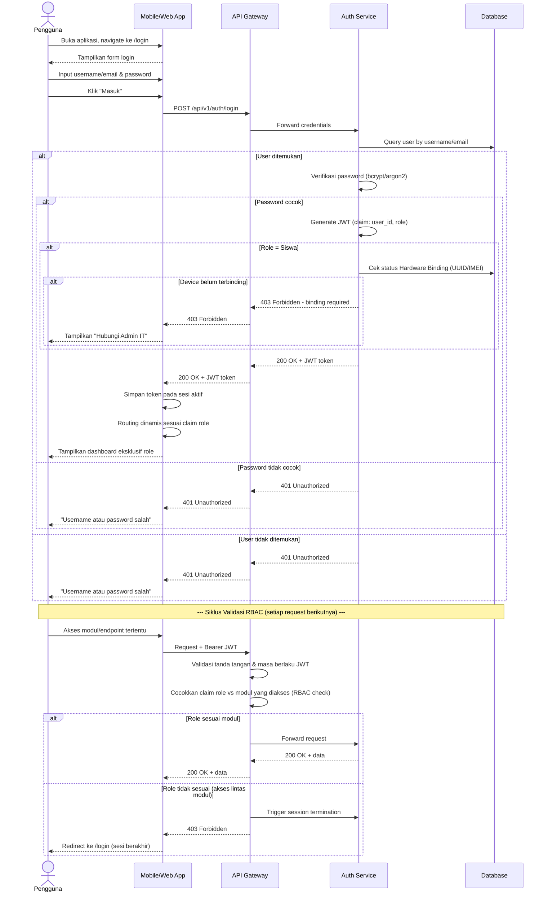

# System Logic: SYS-UC-001 Autentikasi JWT & RBAC Routing

Document Version: v2.0

Use Case ID: SYS-UC-001

Use Case Name: Logika Autentikasi JWT & RBAC Routing

Status: Draft

Last Updated: 2026-07-12

Author: System Analyst AI

User Flow Terkait: `userflow_uc_001.md`

---

## 1. Overview

Dokumen ini mendefinisikan logika backend untuk otentikasi lintas 5 (lima) role (Admin IT, Guru Mapel, Siswa, Orang Tua, Kepala Sekolah) pada satu skema token JWT terpadu, serta mekanisme Role-Based Access Control (RBAC) yang divalidasi ulang oleh API Gateway pada **setiap** request berikutnya — bukan hanya saat login (SRS-ARCH-001, SRS-ARCH-002, SRS-ARCH-003).

---

## 2. Sequence Diagram



---

## 3. API Contract

### 3.1 POST /api/v1/auth/login

Autentikasi pengguna lintas role dan penerbitan token JWT.

**Request Headers:**

| Header | Value |
| --- | --- |
| Content-Type | application/json |

**Request Body:**

```json
{
  "username": "string (required)",
  "password": "string (required)"
}
```

**Success Response (200 OK):**

```json
{
  "success": true,
  "data": {
    "token": "eyJhbGciOiJIUzI1NiIs...",
    "user": {
      "id": 12,
      "username": "guru_fisika_01",
      "full_name": "Budi Santoso",
      "role": "guru_mapel"
    },
    "expires_in": 86400
  },
  "message": "Login successful"
}
```

**Error Response (401 Unauthorized):**

```json
{
  "success": false,
  "data": null,
  "message": "Username atau password salah",
  "errors": []
}
```

**Error Response (403 Forbidden — khusus Siswa belum Hardware Binding):**

```json
{
  "success": false,
  "data": null,
  "message": "Gawai belum terdaftar. Hubungi Admin IT untuk Hardware Binding.",
  "errors": []
}
```

---

### 3.2 GET /api/v1/auth/me

Mengambil informasi pengguna aktif berdasarkan token JWT.

**Request Headers:**

| Header | Value |
| --- | --- |
| Authorization | Bearer \<jwt_token\> |

**Success Response (200 OK):**

```json
{
  "success": true,
  "data": {
    "id": 12,
    "username": "guru_fisika_01",
    "full_name": "Budi Santoso",
    "role": "guru_mapel",
    "created_at": "2026-01-10T00:00:00Z"
  },
  "message": "Success"
}
```

**Error Response (401/403 — RBAC violation):**

```json
{
  "success": false,
  "data": null,
  "message": "Akses ditolak. Sesi telah diakhiri karena akses lintas modul.",
  "errors": []
}
```

---

### 3.3 POST /api/v1/auth/logout

Mengakhiri sesi aktif pengguna.

**Request Headers:**

| Header | Value |
| --- | --- |
| Authorization | Bearer \<jwt_token\> |

**Success Response (200 OK):**

```json
{
  "success": true,
  "data": null,
  "message": "Logout successful"
}
```

---

## 4. Data Flow

| Step | Input | Process | Output |
| --- | --- | --- | --- |
| 1 | Username, Password | Verifikasi kredensial terhadap DB | Kredensial tervalidasi |
| 2 | Kredensial valid + role user | Generate JWT dengan claim role & user_id | Token JWT |
| 3 | Token JWT | Routing dinamis ke dashboard eksklusif role | Sesi aktif per role |
| 4 | Token JWT (request berikutnya) | Validasi ulang tanda tangan, masa berlaku, dan claim role oleh API Gateway (RBAC check) | Izin akses / penolakan + session termination |

---

## 5. Security Rules

| Rule | Description |
| --- | --- |
| RBAC Wajib | RBAC diimplementasikan ketat pada level backend **dan** frontend di kedua platform (SRS-ARCH-001) |
| Zero-Trust per Request | Klaim role dalam JWT divalidasi ulang oleh API Gateway pada **setiap** request siklus presensi, pemindaian wajah, maupun mutasi konfigurasi kelas — bukan hanya saat login (SRS-ARCH-003) |
| Larangan Akses Lintas Modul | Akses ke modul di luar role token dilarang keras dan otomatis memicu session termination (SRS-ARCH-002) |
| Prasyarat Login Siswa | Login Siswa mensyaratkan gawai telah melewati Hardware Binding (UUID/IMEI) oleh Admin IT |
| Password Hashing | Password disimpan dalam bentuk hash (bcrypt/argon2), tidak pernah dalam plaintext |

---

## 6. Traceability

| User Flow | Requirement | API Endpoint |
| --- | --- | --- |
| userflow_uc_001.md | SRS-ARCH-001, SRS-ARCH-002, SRS-ARCH-003 | POST /api/v1/auth/login, GET /api/v1/auth/me |

## 7. Dependensi

- Modul Hardware Binding (validasi tambahan pada login Siswa).
- Seluruh modul lain (SYS-UC-002 s.d SYS-UC-006) bergantung pada output token JWT tervalidasi dari logika ini sebagai prasyarat eksekusi.
