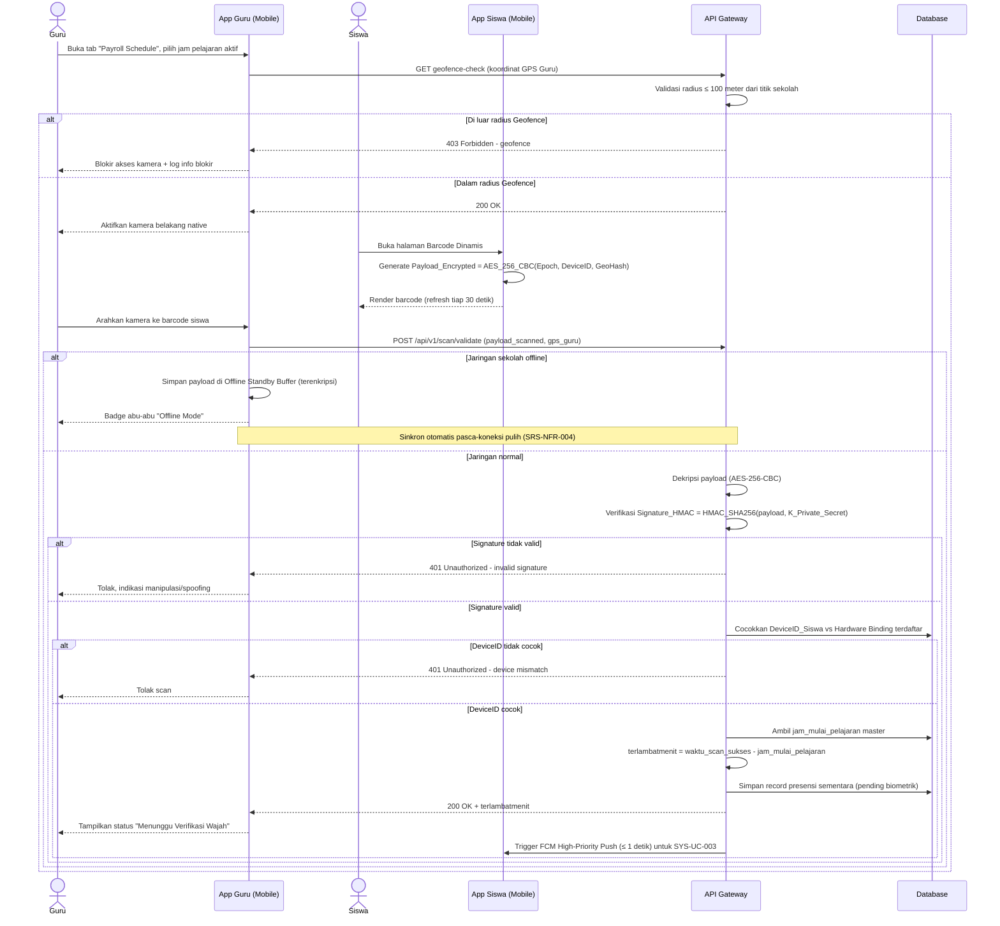

# System Logic: SYS-UC-002 Enkripsi Barcode, Validasi HMAC & Kalkulasi terlambatmenit

Document Version: v2.0

Use Case ID: SYS-UC-002

Use Case Name: Logika Enkripsi Barcode, Validasi HMAC & Kalkulasi `terlambatmenit`

Status: Draft

Last Updated: 2026-07-12

Author: System Analyst AI

User Flow Terkait: `userflow_uc_002.md`

---

## 1. Overview

Dokumen ini mendefinisikan logika sistem untuk siklus pemindaian barcode dinamis siswa oleh Guru Mapel: validasi Geofence sebelum kamera aktif, dekripsi & verifikasi tanda tangan payload, hardware-binding matching, serta kalkulasi variabel `terlambatmenit` yang menjadi dasar status kehadiran (Hadir/Terlambat) dan pemicu SYS-UC-003 (Liveness Detection).

---

## 2. Sequence Diagram



---

## 3. API Contract

### 3.1 POST /api/v1/scan/validate

Validasi hasil pemindaian barcode oleh Guru Mapel dan kalkulasi keterlambatan.

**Request Headers:**

| Header | Value |
| --- | --- |
| Content-Type | application/json |
| Authorization | Bearer \<jwt_token_guru\> |

**Request Body:**

```json
{
  "payload_scanned": "string (base64, required)",
  "signature_hmac": "string (required)",
  "jadwal_id": "int (required)",
  "gps_guru": {
    "lat": -7.826,
    "lng": 110.328
  }
}
```

**Success Response (200 OK):**

```json
{
  "success": true,
  "data": {
    "presensi_id": 5521,
    "siswa_id": 1042,
    "terlambatmenit": 6,
    "status_sementara": "Menunggu Verifikasi Wajah"
  },
  "message": "Scan validated"
}
```

**Error Response (401 Unauthorized — signature/device tidak valid):**

```json
{
  "success": false,
  "data": null,
  "message": "Payload tidak valid atau terindikasi manipulasi",
  "errors": []
}
```

**Error Response (403 Forbidden — di luar Geofence):**

```json
{
  "success": false,
  "data": null,
  "message": "Gawai Guru berada di luar radius toleransi sekolah",
  "errors": []
}
```

---

### 3.2 GET /api/v1/geofence/check

Validasi posisi GPS Guru terhadap titik sekolah sebelum modul kamera diaktifkan.

**Request Headers:**

| Header | Value |
| --- | --- |
| Authorization | Bearer \<jwt_token_guru\> |

**Success Response (200 OK):**

```json
{
  "success": true,
  "data": { "in_range": true, "distance_meter": 42 },
  "message": "Within school geofence"
}
```

---

## 4. Data Flow

| Step | Input | Process | Output |
| --- | --- | --- | --- |
| 1 | GPS Guru | Geofence Validator (radius ≤ 100m) | Izin/blokir akses kamera |
| 2 | Timestamp_Epoch, DeviceID_Siswa, GeoHash | AES_256_CBC encryption (sisi Siswa) | Payload_Encrypted (refresh 30 detik) |
| 3 | Payload_Encrypted | HMAC_SHA256 signing (sisi Server) | Signature_HMAC |
| 4 | Payload hasil scan Guru | Dekripsi + verifikasi HMAC + cocokkan hardware binding | Payload valid/ditolak |
| 5 | Waktu scan sukses, jam_mulai_pelajaran master | Kalkulasi selisih waktu | `terlambatmenit` |
| 6 | Presensi_id valid | Trigger FCM High-Priority Push | Sinyal ke SYS-UC-003 (Liveness Detection) |

---

## 5. Security Rules

| Rule | Description |
| --- | --- |
| Signature Mismatch | `Signature_HMAC` tidak cocok → payload ditolak, dianggap manipulasi/spoofing, tidak diproses lebih lanjut |
| Hardware Binding Check | `DeviceID_Siswa` wajib cocok dengan data hardware binding terdaftar sebelum diproses |
| Offline Standby Buffer | Jika jaringan sekolah terputus, payload disimpan terenkripsi lokal pada gawai Guru dan disinkronkan otomatis pasca-koneksi pulih (SRS-NFR-004) |
| Universal Scanner Restriction | Pemindaian via aplikasi kamera pihak ketiga (di luar ekosistem, mis. Google Lens) hanya menghasilkan string acak tidak tereksekusi |
| Refresh Cycle | Barcode disegarkan otomatis setiap 30 detik dari memory buffer gawai untuk mencegah distribusi kode ke luar kelas |
| Geofence Tolerance | Kamera pemindai Guru hanya aktif jika GPS berada dalam radius toleransi ≤ 100 meter dari titik sekolah (SRS-FR-MAPEL-002) |

---

## 6. Traceability

| User Flow | Requirement | API Endpoint |
| --- | --- | --- |
| userflow_uc_002.md | SRS-FR-MAPEL-001, SRS-FR-MAPEL-002, SRS-FR-SWS-001, SRS-FR-SWS-004, SRS-NFR-004 | POST /api/v1/scan/validate, GET /api/v1/geofence/check |

## 7. Dependensi

- SYS-UC-001 (token JWT Guru harus valid sebelum modul scanner dapat diakses).
- SYS-UC-003 (kelanjutan proses menuju verifikasi biometrik wajah).
