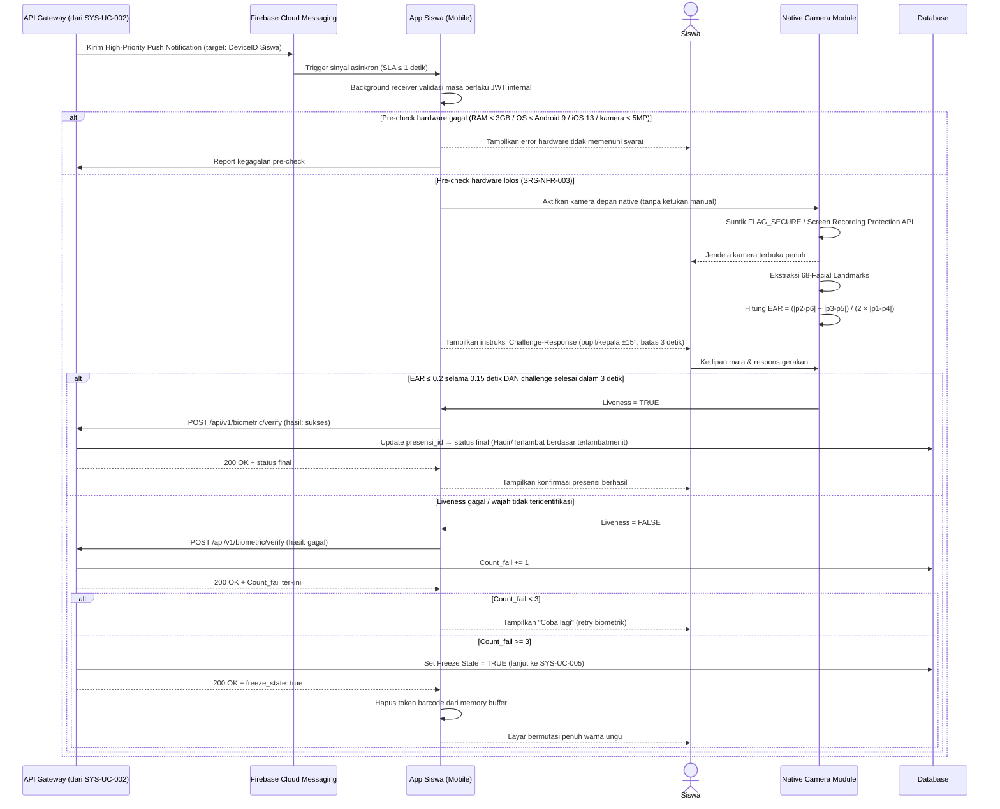

# System Logic: SYS-UC-003 Algoritma Liveness Detection (EAR & Challenge-Response)

Document Version: v2.0

Use Case ID: SYS-UC-003

Use Case Name: Algoritma Liveness Detection (EAR & Challenge-Response)

Status: Draft

Last Updated: 2026-07-12

Author: System Analyst AI

User Flow Terkait: `userflow_uc_003.md`

---

## 1. Overview

Dokumen ini mendefinisikan logika Faktor Otentikasi Kedua (2FA) berbasis Face Recognition & Face Liveness Detection pada gawai siswa. Proses bersifat closed-loop handshake: hanya dapat dipicu oleh backend (via FCM push) pasca-scan barcode sukses (SYS-UC-002), tidak boleh diinisiasi sepihak dari sisi klien.

---

## 2. Sequence Diagram



---

## 3. API Contract

### 3.1 POST /api/v1/biometric/verify

Mengirim hasil pemrosesan lokal Face Liveness Detection ke backend.

**Request Headers:**

| Header | Value |
| --- | --- |
| Content-Type | application/json |
| Authorization | Bearer \<jwt_token_siswa\> |

**Request Body:**

```json
{
  "presensi_id": "int (required)",
  "ear_value": "number (required)",
  "challenge_response_result": "boolean (required)",
  "hasil_akhir": "string (enum: sukses, gagal, required)"
}
```

**Success Response (200 OK — verifikasi sukses):**

```json
{
  "success": true,
  "data": {
    "presensi_id": 5521,
    "status_final": "Terlambat",
    "terlambatmenit": 6,
    "count_fail": 0
  },
  "message": "Verifikasi biometrik berhasil"
}
```

**Success Response (200 OK — gagal, belum freeze):**

```json
{
  "success": true,
  "data": {
    "presensi_id": 5521,
    "status_final": null,
    "count_fail": 2,
    "freeze_state": false
  },
  "message": "Verifikasi gagal, silakan coba kembali"
}
```

**Response (200 OK — freeze terpicu):**

```json
{
  "success": true,
  "data": {
    "presensi_id": 5521,
    "count_fail": 3,
    "freeze_state": true
  },
  "message": "Gawai dibekukan setelah 3 kali gagal verifikasi"
}
```

---

## 4. Data Flow

| Step | Input | Process | Output |
| --- | --- | --- | --- |
| 1 | Sinyal FCM dari SYS-UC-002 | Background receiver + validasi JWT internal | Kamera depan aktif (≤ 1 detik) |
| 2 | Spesifikasi hardware gawai | Pre-check RAM/OS/kamera (SRS-NFR-003) | Izin/blokir modul biometrik |
| 3 | Stream kamera depan | Ekstraksi 68-Facial Landmarks + kalkulasi EAR | Nilai EAR real-time |
| 4 | Instruksi Challenge-Response | Deteksi gerakan pupil/kepala ±15° dalam 3 detik | Hasil challenge sukses/gagal |
| 5 | EAR + hasil challenge | Keputusan otentikasi biometrik | Status sukses/gagal + `Count_fail` |
| 6 | `Count_fail` | Uji kondisi `Count_fail >= 3` | Status presensi final ATAU Freeze State (→ SYS-UC-005) |

---

## 5. Security Rules

| Rule | Description |
| --- | --- |
| Closed-Loop Handshake | Modul biometrik dilarang keras dipicu dari inisiasi sepihak gawai siswa; wajib melalui trigger FCM dari backend |
| Native Screen Protection | `FLAG_SECURE` (Android) / Screen Recording Protection API (iOS) disuntikkan ke jendela kamera sebelum capture dimulai |
| EAR Threshold | Kedipan valid terdeteksi jika `EAR ≤ 0.2` bertahan selama `0.15` detik |
| Challenge Timeout | Challenge-response (pupil/kepala ±15°) wajib diselesaikan dalam jendela waktu 3 detik |
| Hardware Minimum | Modul biometrik hanya aktif jika OS ≥ Android 9 (Pie)/iOS 13, RAM ≥ 3GB, kamera depan ≥ 5MP (SRS-NFR-003) |
| Freeze Trigger | `Count_fail ≥ 3` memicu isolasi mandiri lokal: token barcode dihapus dari memory buffer, layar bermutasi penuh `#805AD5` |

---

## 6. Traceability

| User Flow | Requirement | API Endpoint |
| --- | --- | --- |
| userflow_uc_003.md | SRS-FR-SWS-002, SRS-FR-SWS-003, SRS-NFR-003 | POST /api/v1/biometric/verify |

## 7. Dependensi

- SYS-UC-002 (prasyarat: hasil scan barcode valid dan sinyal FCM diterima).
- SYS-UC-005 (jalur lanjutan jika Freeze State terpicu).
