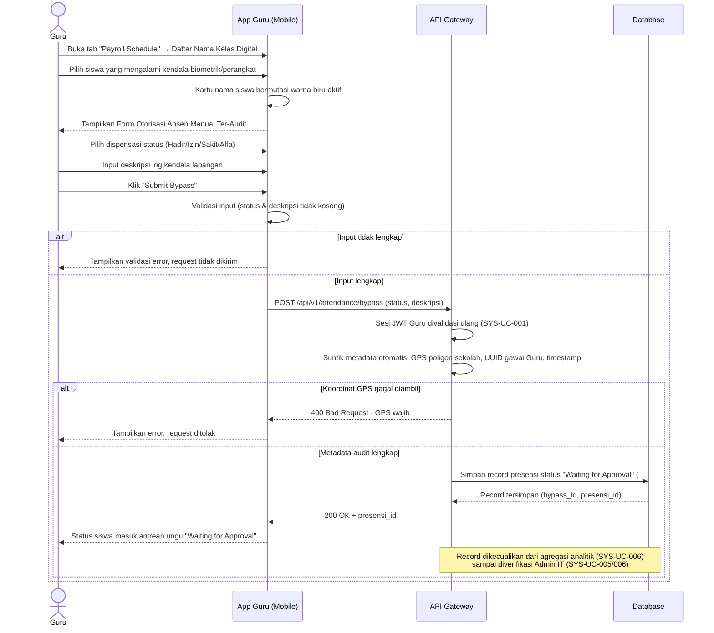

# System Logic: SYS-UC-004 Audit Trail Bypass Manual Guru

Document Version: v2.0

Use Case ID: SYS-UC-004

Use Case Name: Logika Audit Trail Bypass Manual Guru

Status: Draft

Last Updated: 2026-07-12

Author: System Analyst AI

User Flow Terkait: `userflow_uc_004.md`

---

## 1. Overview

Dokumen ini mendefinisikan logika Otorisasi Absen Manual Ter-Audit (SRS-FR-MAPEL-003) yang digunakan Guru Mapel saat gawai siswa mengalami kendala teknis (kerusakan/pencahayaan buruk). Setiap submission wajib disertai metadata audit yang disuntikkan otomatis oleh sistem dan tidak dapat diedit Guru, serta menghasilkan status sementara `Waiting for Approval` hingga diverifikasi Admin IT.

---

## 2. Sequence Diagram



---

## 3. API Contract

### 3.1 POST /api/v1/attendance/bypass

Membuat record presensi via otorisasi manual ter-audit oleh Guru Mapel.

**Request Headers:**

| Header | Value |
| --- | --- |
| Content-Type | application/json |
| Authorization | Bearer \<jwt_token_guru\> |

**Request Body:**

```json
{
  "siswa_id": "int (required)",
  "jadwal_id": "int (required)",
  "status_dispensasi": "string (enum: Hadir, Izin, Sakit, Alfa, required)",
  "deskripsi_alasan": "string (required)"
}
```

**Request Example:**

```json
{
  "siswa_id": 1042,
  "jadwal_id": 88,
  "status_dispensasi": "Sakit",
  "deskripsi_alasan": "Gawai siswa mati total, tidak dapat memindai barcode"
}
```

**Success Response (200 OK):**

```json
{
  "success": true,
  "data": {
    "bypass_id": 301,
    "presensi_id": 5522,
    "status_persetujuan": "Waiting for Approval",
    "metadata_audit": {
      "koordinat_gps_guru": { "lat": -7.826, "lng": 110.328 },
      "uuid_gawai_guru": "a1b2c3d4-...",
      "timestamp": "2026-07-12T08:12:00+07:00"
    }
  },
  "message": "Bypass request submitted, waiting for Admin IT approval"
}
```

**Error Response (400 Bad Request):**

```json
{
  "success": false,
  "data": null,
  "message": "Validation failed",
  "errors": [
    { "field": "deskripsi_alasan", "message": "Deskripsi alasan wajib diisi" },
    { "field": "gps", "message": "Koordinat GPS gagal diambil, wajib untuk audit" }
  ]
}
```

---

## 4. Data Flow

| Step | Input | Process | Output |
| --- | --- | --- | --- |
| 1 | siswa_id, status_dispensasi, deskripsi_alasan | Validasi kelengkapan field wajib | Input tervalidasi |
| 2 | Sesi JWT Guru | Validasi ulang token (SYS-UC-001) | Otorisasi request |
| 3 | GPS gawai Guru, UUID gawai | Suntik metadata audit otomatis (immutable) | Metadata audit lengkap |
| 4 | Data bypass + metadata | Simpan record presensi status `Waiting for Approval` | Record presensi pending |
| 5 | Record pending | Masuk antrean verifikasi Admin IT | Kandidat data terfilter dari agregasi (SYS-UC-006) |

---

## 5. Security Rules

| Rule | Description |
| --- | --- |
| Field Wajib | Jika deskripsi alasan kosong → request ditolak, tidak ada record dibuat |
| GPS Wajib | Jika koordinat GPS gagal diambil → request ditolak, metadata audit wajib lengkap |
| Immutable Audit Metadata | GPS, UUID gawai Guru, dan timestamp disuntikkan otomatis oleh sistem dan tidak dapat diedit oleh Guru |
| Status Non-Final | Record hasil bypass **selalu** berstatus `Waiting for Approval`, tidak pernah langsung final |
| Data Integrity Gate | Record berstatus `Waiting for Approval` dilarang keras ikut dihitung/dirender pada agregasi analitik (SYS-UC-006) sebelum diverifikasi resmi Admin IT |

---

## 6. Traceability

| User Flow | Requirement | API Endpoint |
| --- | --- | --- |
| userflow_uc_004.md | SRS-FR-MAPEL-003 | POST /api/v1/attendance/bypass |

## 7. Dependensi

- SYS-UC-001 (sesi JWT Guru harus valid).
- SYS-UC-006 (record ini menjadi kandidat data yang difilter pada lapisan agregasi hingga diverifikasi Admin IT).
