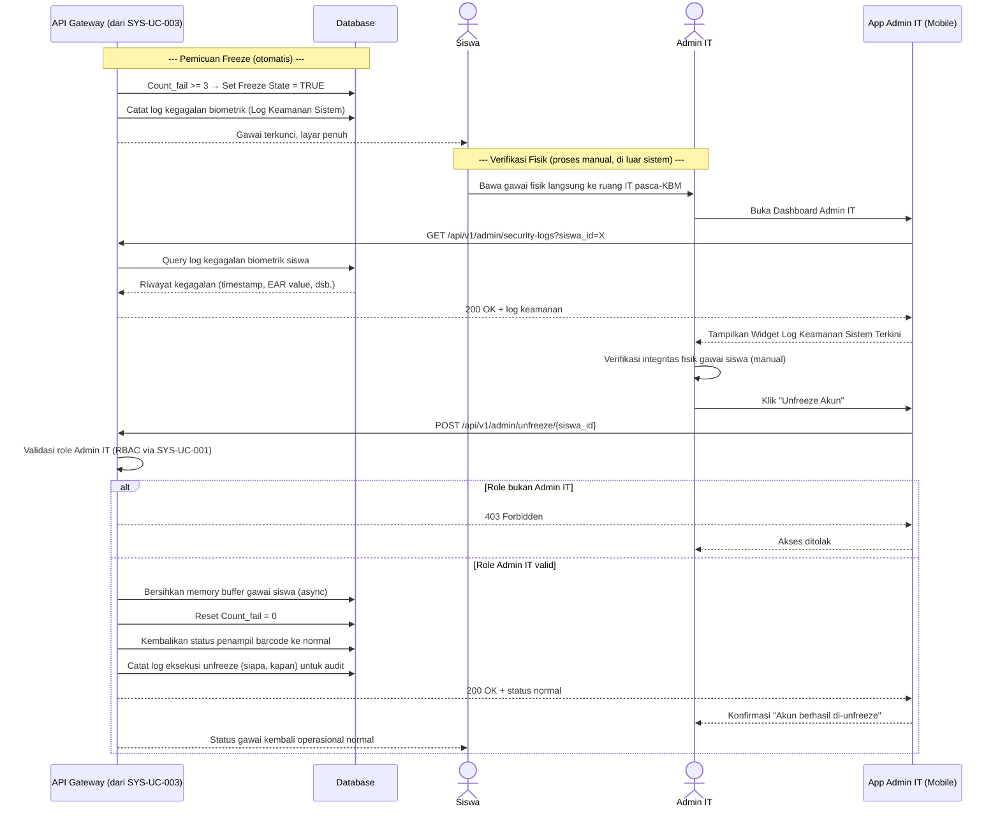

# System Logic: SYS-UC-005 Reset Freeze State & Unfreeze Counter

Document Version: v2.0

Use Case ID: SYS-UC-005

Use Case Name: Logika Reset Freeze State & Unfreeze Counter

Status: Draft

Last Updated: 2026-07-12

Author: System Analyst AI

User Flow Terkait: `userflow_uc_005.md`

---

## 1. Overview

Dokumen ini mendefinisikan logika pembekuan otomatis akun/gawai siswa (`Count_fail >= 3` dari SYS-UC-003) dan protokol pemulihannya (SRS-FR-ADM-003), yang **wajib** melalui verifikasi fisik gawai oleh Admin IT — remote unfreeze dilarang keras.

---

## 2. Sequence Diagram



---

## 3. API Contract

### 3.1 GET /api/v1/admin/security-logs

Mengambil riwayat log kegagalan biometrik untuk keperluan verifikasi Admin IT.

**Request Headers:**

| Header | Value |
| --- | --- |
| Authorization | Bearer \<jwt_token_admin\> |

**Query Parameters:**

| Parameter | Type | Description |
| --- | --- | --- |
| siswa_id | int | Filter log berdasarkan siswa tertentu |

**Success Response (200 OK):**

```json
{
  "success": true,
  "data": [
    {
      "attempt_id": 771,
      "siswa_id": 1042,
      "ear_value": 0.31,
      "challenge_response_result": false,
      "hasil_akhir": "gagal",
      "timestamp": "2026-07-12T08:05:12+07:00"
    }
  ],
  "message": "Success"
}
```

---

### 3.2 POST /api/v1/admin/unfreeze/{siswa_id}

Eksekusi perintah Unfreeze Akun pasca-verifikasi fisik gawai.

**Request Headers:**

| Header | Value |
| --- | --- |
| Authorization | Bearer \<jwt_token_admin\> |

**Success Response (200 OK):**

```json
{
  "success": true,
  "data": {
    "siswa_id": 1042,
    "count_fail": 0,
    "status_freeze": false,
    "waktu_unfreeze": "2026-07-12T14:20:00+07:00",
    "admin_id": 5
  },
  "message": "Akun berhasil di-unfreeze"
}
```

**Error Response (403 Forbidden — bukan role Admin IT):**

```json
{
  "success": false,
  "data": null,
  "message": "Hanya Admin IT yang memiliki hak eksekusi Unfreeze Akun",
  "errors": []
}
```

---

## 4. Data Flow

| Step | Input | Process | Output |
| --- | --- | --- | --- |
| 1 | `Count_fail >= 3` (dari SYS-UC-003) | Set Freeze State = TRUE, isolasi mandiri lokal | Gawai terkunci, layar `#805AD5` |
| 2 | Log kegagalan biometrik | Simpan ke widget Log Keamanan Sistem | Riwayat dapat diakses Admin IT |
| 3 | Verifikasi fisik gawai (manual, di luar sistem) | Admin IT memeriksa integritas fisik | Keputusan layak/tidak layak unfreeze |
| 4 | Perintah "Unfreeze Akun" | Bersihkan buffer, reset `Count_fail = 0`, kembalikan status normal | Gawai operasional normal + log audit |

---

## 5. Security Rules

| Rule | Description |
| --- | --- |
| Larangan Remote Unfreeze | Sistem wajib menolak setiap request unfreeze yang tidak disertai proses verifikasi fisik gawai (SRS-FR-ADM-003); tidak ada endpoint/mekanisme unfreeze jarak jauh yang diizinkan |
| RBAC Ketat | Hanya role Admin IT yang memiliki hak eksekusi perintah "Unfreeze Akun" (divalidasi via SYS-UC-001) |
| Audit Trail Wajib | Setiap eksekusi unfreeze (siapa, kapan) wajib dicatat untuk kebutuhan Sub-View Riwayat Log Unfreeze Kepala Sekolah |
| Freeze Trigger Otomatis | `Count_fail ≥ 3` memicu Freeze State secara otomatis tanpa intervensi manual |

---

## 6. Traceability

| User Flow | Requirement | API Endpoint |
| --- | --- | --- |
| userflow_uc_005.md | SRS-FR-ADM-003 | GET /api/v1/admin/security-logs, POST /api/v1/admin/unfreeze/{siswa_id} |

## 7. Dependensi

- SYS-UC-003 (sumber pemicu Freeze State).
- SYS-UC-001 (validasi role Admin IT).
- SYS-UC-006 (log unfreeze tersedia sebagai Sub-View Read-Only bagi Kepala Sekolah).
