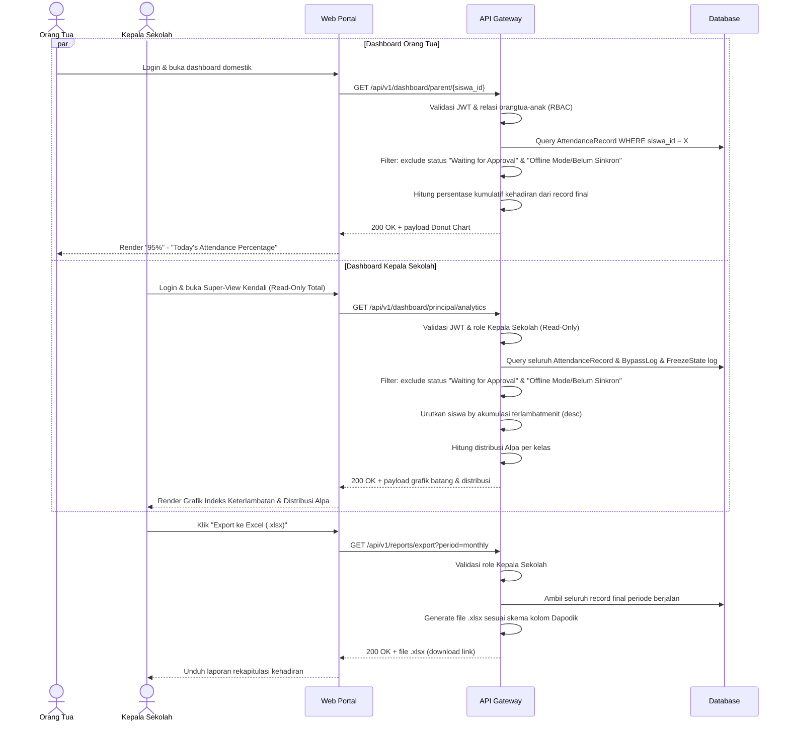

# System Logic: SYS-UC-006 Agregasi Data Analitik & Klausul Integritas Data

Document Version: v2.0

Use Case ID: SYS-UC-006

Use Case Name: Logika Agregasi Data Analitik & Klausul Integritas Data

Status: Draft

Last Updated: 2026-07-12

Author: System Analyst AI

User Flow Terkait: `userflow_uc_006.md`

---

## 1. Overview

Dokumen ini mendefinisikan logika agregasi data presensi menuju Dashboard Orang Tua (Donut Chart) dan Dashboard Kepala Sekolah (Grafik Batang Indeks Keterlambatan, Grafik Distribusi Alpa, Export Dapodik), beserta Klausul Integritas Mutlak yang mewajibkan penyaringan data berstatus non-final (`Waiting for Approval`, `Offline Mode`) sebelum data mencapai lapisan analitik.

---

## 2. Sequence Diagram



---

## 3. API Contract

### 3.1 GET /api/v1/dashboard/parent/{siswa_id}

Mengambil data agregasi kehadiran anak untuk Dashboard Orang Tua.

**Request Headers:**

| Header | Value |
| --- | --- |
| Authorization | Bearer \<jwt_token_orangtua\> |

**Success Response (200 OK):**

```json
{
  "success": true,
  "data": {
    "siswa_id": 1042,
    "persentase_kehadiran": 95,
    "label": "Today's Attendance Percentage",
    "riwayat_harian": [
      { "mapel": "Fisika", "jam_ke": 1, "status": "Terlambat", "terlambatmenit": 6, "waktu": "07:16" }
    ]
  },
  "message": "Success"
}
```

**Error Response (403 Forbidden — relasi anak tidak terdaftar):**

```json
{
  "success": false,
  "data": null,
  "message": "Akses ditolak, siswa tidak terdaftar sebagai anak dari akun ini",
  "errors": []
}
```

---

### 3.2 GET /api/v1/dashboard/principal/analytics

Mengambil data analitik agregat untuk Super-View Kepala Sekolah (Read-Only Total).

**Request Headers:**

| Header | Value |
| --- | --- |
| Authorization | Bearer \<jwt_token_kepsek\> |

**Success Response (200 OK):**

```json
{
  "success": true,
  "data": {
    "indeks_keterlambatan": [
      { "siswa_id": 1042, "nama": "Ahmad", "kelas": "XI-A", "total_terlambatmenit": 84 }
    ],
    "distribusi_alpa": [
      { "kelas": "XI-A", "total_alpa": 12 },
      { "kelas": "XI-B", "total_alpa": 7 }
    ]
  },
  "message": "Success"
}
```

**Error Response (403 Forbidden — percobaan mutasi data):**

```json
{
  "success": false,
  "data": null,
  "message": "Role Kepala Sekolah hanya memiliki akses Read-Only Total",
  "errors": []
}
```

---

### 3.3 GET /api/v1/reports/export

Mengekstrak laporan rekapitulasi kehadiran ke format Excel (.xlsx) untuk sinkronisasi Dapodik.

**Request Headers:**

| Header | Value |
| --- | --- |
| Authorization | Bearer \<jwt_token_kepsek\> |

**Query Parameters:**

| Parameter | Type | Description |
| --- | --- | --- |
| period | string | `monthly` atau `semesterly` |

**Success Response (200 OK):**

```json
{
  "success": true,
  "data": {
    "file_url": "https://storage.example.sch.id/reports/rekap-2026-07.xlsx",
    "generated_at": "2026-07-12T15:00:00+07:00",
    "total_records": 4820
  },
  "message": "Report generated successfully"
}
```

---

## 4. Data Flow

| Step | Input | Process | Output |
| --- | --- | --- | --- |
| 1 | Seluruh record dari SYS-UC-002/003 (scan+biometrik) dan SYS-UC-004 (bypass) | Filtering status (Data Integrity Gate): exclude `Waiting for Approval` & `Offline Mode` belum sinkron | Dataset record final terverifikasi |
| 2 | Dataset final per siswa | Hitung persentase kumulatif kehadiran | Payload Donut Chart Orang Tua |
| 3 | Dataset final seluruh siswa | Urutkan berdasarkan akumulasi `terlambatmenit` | Payload Grafik Batang Indeks Keterlambatan |
| 4 | Dataset final per kelas | Hitung jumlah status Alpa per kelas | Payload Grafik Distribusi Alpa |
| 5 | Dataset final periode berjalan | Generate file `.xlsx` sesuai skema Dapodik | File laporan siap diunduh/disinkronkan |

---

## 5. Security Rules

| Rule | Description |
| --- | --- |
| **Klausul Integritas Mutlak** | Sistem dilarang keras merender atau menghitung data berstatus `Waiting for Approval` atau `Offline Mode` ke dalam komponen analitik apa pun sebelum diverifikasi/disetujui resmi oleh Admin IT |
| Read-Only Total | Akses Kepala Sekolah terbatas Read-Only Total — sistem menolak setiap request mutasi data dari role ini (SRS-FR-KS-001) |
| Relasi Data Anak | Data yang ditampilkan ke Orang Tua wajib difilter berdasarkan relasi entitas anak-orang tua terdaftar; dilarang menampilkan data siswa lain |
| Format Export Resmi | Export laporan wajib menggunakan format `.xlsx` resmi sesuai skema kolom sinkronisasi Dapodik nasional |

---

## 6. Traceability

| User Flow | Requirement | API Endpoint |
| --- | --- | --- |
| userflow_uc_006.md | SRS-FR-ORT-001, SRS-FR-KS-001, SRS-FR-KS-002, SRS-FR-KS-003 | GET /api/v1/dashboard/parent/{siswa_id}, GET /api/v1/dashboard/principal/analytics, GET /api/v1/reports/export |

## 7. Dependensi

- SYS-UC-002, SYS-UC-003 (sumber data presensi hasil scan/biometrik).
- SYS-UC-004 (sumber data bypass yang wajib difilter hingga terverifikasi).
- SYS-UC-005 (log unfreeze yang ditampilkan pada Sub-View Kepala Sekolah).
